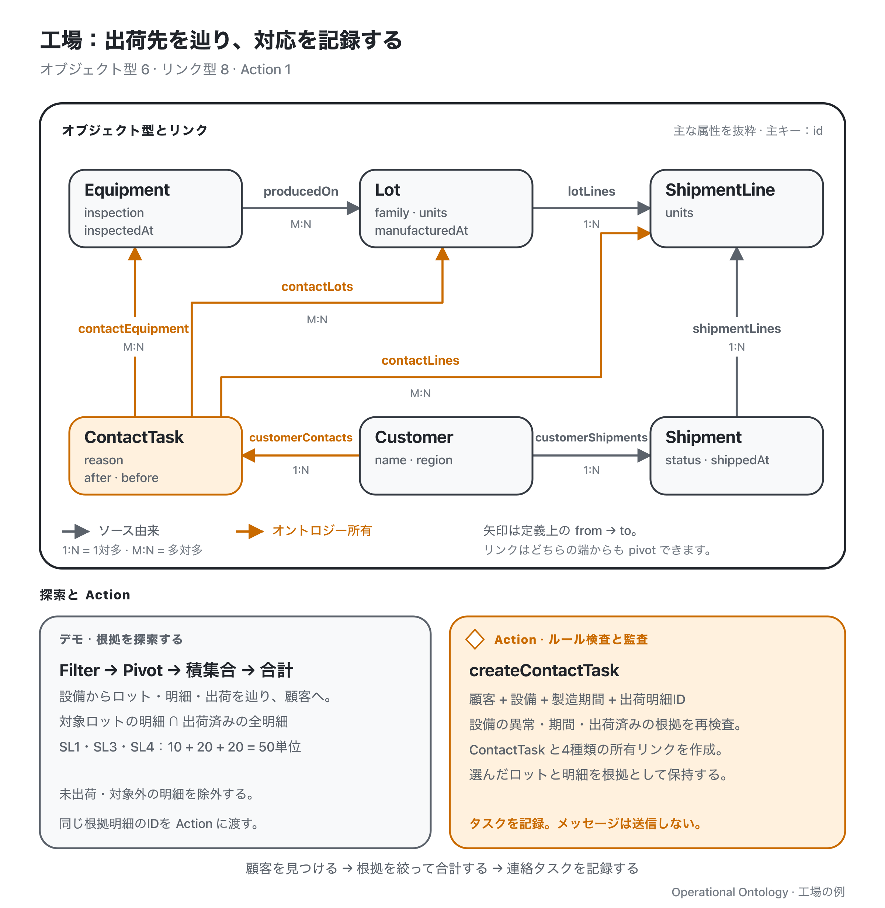

[English](./README.md) | **日本語**

# 工場：点検で見つかった異常から顧客連絡へ

リポジトリのルートで `pnpm demo:factory` を実行します。架空の MES・WMS と、メモリ上のオントロジーストアを使い、毎回初期状態から始めます。

9月8日の設備点検で PRESS-1 の異常が確認されました。出荷時の検査は合格しており、9月7日に出荷済みです。今回の調査には、9月6日を製造日の対象範囲として与えます。製品への影響は疑いの段階で、既知の不良品を出荷した理由や、故障開始時刻を推定する例ではありません。



グレーはソース由来、オレンジはオントロジーが所有する状態です。全オブジェクト型・リンク型を示し、属性は抜粋しています。[編集用 SVG](./assets/ontology-overview.ja.svg)。

**[▶ オントロジーの捜査型分析解説｜工場編（日本語音声・6:16）](https://www.youtube.com/watch?v=p6pljWy4xzg)**

<a href="https://www.youtube.com/watch?v=p6pljWy4xzg">
  
</a>

[`demo.ts`](./demo.ts) は動画の探索と根拠の流れに沿っています。

`demo.ts` は Runtime の filter・pivot・集合演算を直接組み合わせます。各操作で入力と結果の型・ID・件数を表示します。

| 段階 | 結果 |
| --- | --- |
| 点検で異常があった設備を filter | PRESS-1 |
| 製造履歴へ pivot | L1・L2・L3 |
| 与えられた製造期間で filter | L1・L3 |
| 出荷明細へ pivot | SL1・SL3・SL5・SL4 |
| 出荷へ pivot し、出荷済みを filter | S1・S2 |
| 顧客へ pivot | C1（Aoba）、重複を除いて1件 |
| 出荷済みの出荷から、含まれる全明細へ pivot | SL1・SL6・SL3・SL4 |
| 元の対象明細との積集合を取る | SL1・SL3・SL4 |
| 残った明細の数量を合計する | 10 + 20 + 20 = 50単位 |
| 同じ根拠明細のIDでタスクを作る | CONTACT-C1 と7本のリンク |

C1 は対象ロットの出荷先なので見つかります。C2 の L2 は9月5日製造なので対象外です。C3 宛ての L1 の残り10単位は未出荷のため除外します。L1 は出荷済みの S1・S2 に含まれますが、各段階で同じ対象の重複を除きます。

デモでは、対象ロットの明細を集合 A、出荷済みの S1・S2 に含まれる全明細を集合 B として保持します。積集合で未出荷の SL5 と、対象外の L4 の明細 SL6 を除外します。残った SL1・SL3・SL4 の `units` を合計すると、2出荷で50単位になります。対象ロットは未出荷分を含めて60単位、出荷済みの出荷は対象外の商品も含めて55単位です。数量は出荷明細の粒度で求めます。この積集合からそのまま Action の `lineIds` を作るため、画面で追った探索、合計数量、保存する根拠がつながります。

担当者は根拠を確認し、`createContactTask` を実行します。Action は設備の点検結果、製造期間、顧客、出荷済み明細の根拠を検査し、タスクと顧客・設備・ロット・明細へのリンクを原子的に作ります。タスクは ontology-owned です。メッセージは送らず、出荷済み商品を保留にしようともしません。再インデックス後もタスクと根拠リンクを保持しますが、リンクが指すソースレコードの内容を過去のまま固定するものではありません。

## コードと MCP

[`demo.ts`](./demo.ts) から読み、Action とそのルールは [`ontology.ts`](./ontology.ts) で確認できます。`fixtures.ts`・`integrate.ts` が既存のソースの事実を供給し、`runtime.ts` がモデルの読み取りとランタイムを接続します。ソースへの書き戻しは [orders](../orders/ontology.ts)、候補検索の Function と割当は [hospital](../hospital/README.ja.md)、共通項の調査は [finance](../finance/README.ja.md) で扱います。

`pnpm mcp:factory` で起動します。リポジトリのルートからは次でも接続できます。

```sh
claude --strict-mcp-config --mcp-config examples/factory/.mcp.json
```

モデルから読み取り・pivot・集合演算・集計のツールと `create_contact_task` を生成します。エージェントは自身のコード実行環境で取得済みオブジェクトを絞り、選んだIDを次のツールへ渡します。`pivot_shipment_lines` で各明細集合を得て、`intersect_shipment_line` で共通する根拠を残し、その数量を合計してから根拠のIDを Action に渡します。`scenario.test.ts` の MCP テストでこの流れを確認できます。工場モデルには利用者に代わって探索を完了する Function は定義していません。契約は [IMPLEMENTATION.ja.md](../../IMPLEMENTATION.ja.md) にあります。単一の書き込み元と、判断に関係する全資源が見えることを前提とします。
