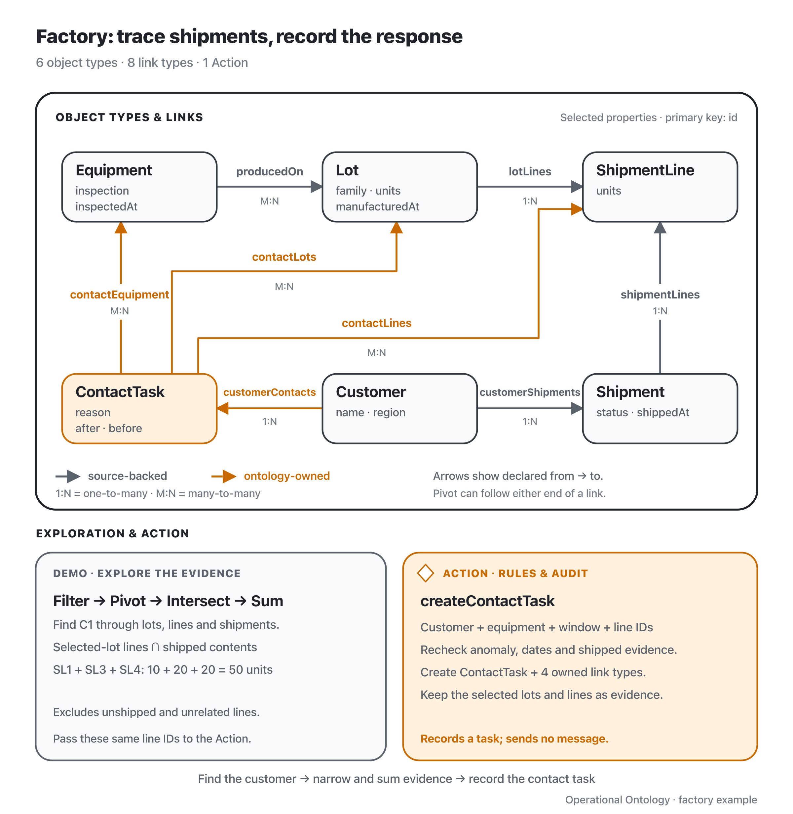

**English** | [日本語](./README.ja.md)

# Factory: from an inspection finding to customer contact

Run `pnpm demo:factory` from the repository root. The demo uses synthetic MES and WMS databases and an in-memory ontology store; each run starts fresh.

On September 8, an equipment inspection identifies an anomaly on PRESS-1. Release inspections had passed, and shipments left on September 7. The investigation is given September 6 as its manufacturing window. It is looking for potentially affected products, not explaining why known defective goods were shipped or estimating when the fault began.



Gray: source-backed state. Orange: ontology-owned state. The diagram shows all object and link types, with selected properties. [Editable SVG](./assets/ontology-overview.svg).

**[▶ Ontology: Investigative Analysis Explained | Factory (English narration, 6:02)](https://www.youtube.com/watch?v=kQFvOResIvI)**

<a href="https://www.youtube.com/watch?v=kQFvOResIvI">
  
</a>

[`demo.ts`](./demo.ts) follows the video's exploration and evidence flow.

`demo.ts` uses the runtime's filter, pivot and set operations directly. Each operation prints its input and result types, IDs and counts:

| Step | Result |
| --- | --- |
| Filter equipment by inspection anomaly | PRESS-1 |
| Pivot to production history | L1, L2, L3 |
| Filter the supplied manufacturing window | L1, L3 |
| Pivot to shipment lines | SL1, SL3, SL5, SL4 |
| Pivot to shipments and filter shipped status | S1, S2 |
| Pivot to customers | C1 (Aoba), once |
| Pivot from shipped shipments back to all their lines | SL1, SL6, SL3, SL4 |
| Intersect with the affected lines | SL1, SL3, SL4 |
| Sum units on the retained lines | 10 + 20 + 20 = 50 |
| Create a task with those same evidence IDs | CONTACT-C1 and seven links |

C1 is found because it received the selected lots. C2 is excluded because its L2 was made September 5. The remaining 10 units of L1 destined for C3 are excluded because they have not shipped. L1 appears in shipped S1 and S2; set membership deduplicates identities at every step.

The demo keeps two ShipmentLine sets: A contains the selected lots' lines, and B contains everything in shipped S1 and S2. Their intersection excludes unshipped SL5 and unrelated SL6 from L4. Summing `units` on SL1, SL3 and SL4 gives 50 affected shipped units across two shipments. The selected lots contain 60 units including unshipped goods; the shipped shipments contain 55 units including unrelated goods. Quantity belongs to each shipment-line record. The same intersection supplies the Action's `lineIds`, so the visible exploration, total and saved evidence stay connected.

The operator reviews the evidence and executes `createContactTask`. The Action checks the equipment finding, manufacturing window, customer and shipped-line evidence, then atomically creates an ontology-owned task with links to the customer, equipment, lots and lines. It sends no message and does not attempt to hold goods already shipped. Re-indexing preserves the task and evidence links; those links identify source records rather than freezing their historical contents.

## Code and MCP

Start with [`demo.ts`](./demo.ts), then the Action and its rules in [`ontology.ts`](./ontology.ts). `fixtures.ts` and `integrate.ts` supply existing source facts, `runtime.ts` wires model reads to the runtime. Source write-back is covered in [orders](../orders/ontology.ts), candidate Functions and allocation in [hospital](../hospital/README.md), and shared recipients in [finance](../finance/README.md).

Run `pnpm mcp:factory`, or connect from the repository root with:

```sh
claude --strict-mcp-config --mcp-config examples/factory/.mcp.json
```

The server generates read/pivot/set/aggregate tools and `create_contact_task` from the model. Agents filter returned objects in their own code execution environment and pass selected IDs to the next tool. `pivot_shipment_lines` returns each line set, `intersect_shipment_line` retains their common evidence, and the agent sums its units before passing its IDs to the Action. The MCP test in `scenario.test.ts` exercises this sequence; the factory model defines no Function that completes the exploration for the caller. Runtime contracts are in [IMPLEMENTATION.md](../../IMPLEMENTATION.md). This example assumes one writer and visibility of all resources relevant to a decision.
